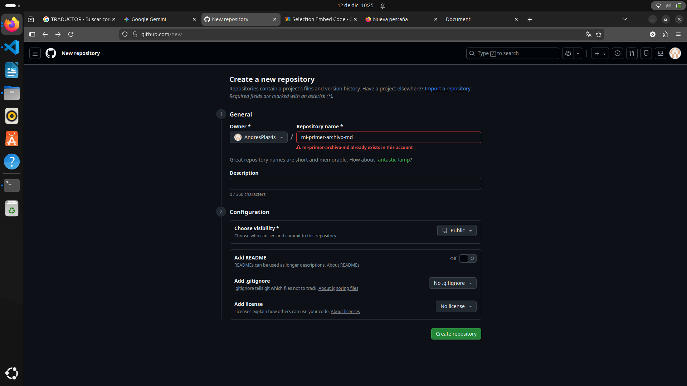
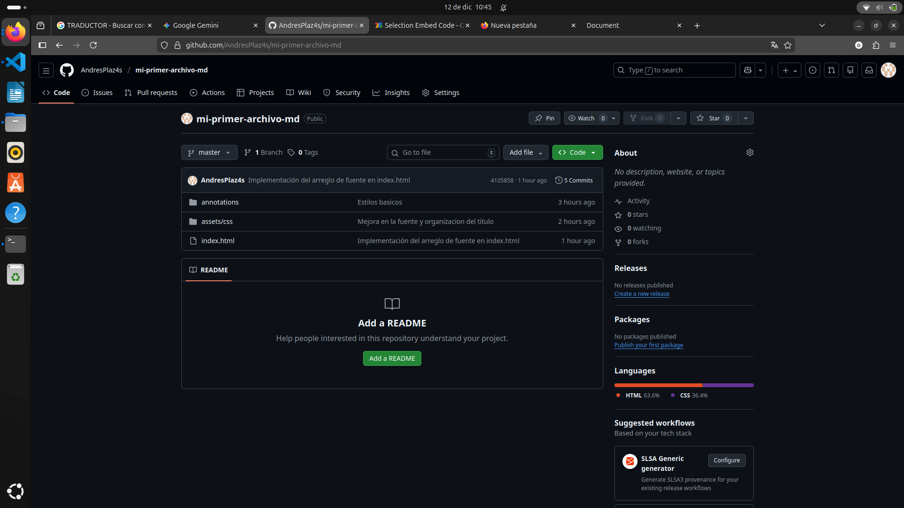
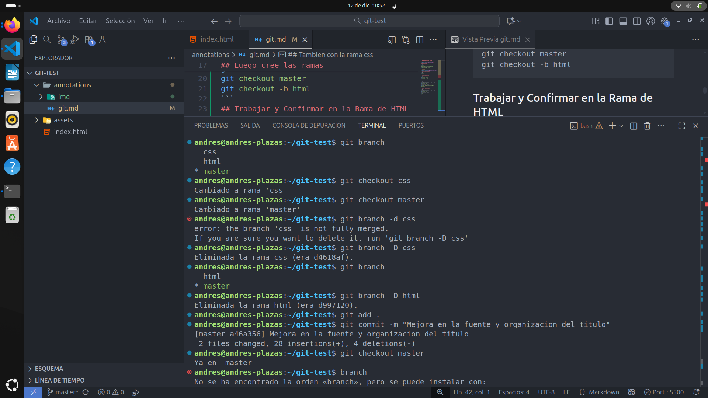

## CREAR REPOSITORIO EN GITHUB


## Enlazar reposiotorio local con el nuevo creado en github
```sh
git init
git remote add origin https://github.com/AndresPlaz4s/mi-primer-archivo-md
git push -u origin master
```
**Aca ya esta subido mi repositorio locl al github**

## Inicializar repositorio
```sh
git init
```

## Luego cree las ramas 
```sh
git checkout -b css
git checkout master
git checkout -b html
```
## Trabajar y Confirmar en la Rama de HTML 

```sh
#me aseguro de estar en la rama qe voy a trabajar
git checkout html
#Hago todos mis cambios 
git add .
git commit -m "Sección inicial HTML completada"
```

## Tambien con la rama css
```sh
#me aseguro de estar en la rama qe voy a trabajar
git checkout css
#Hago todos mis cambios 
git add .
git commit -m "Sección de css completada"
```
**Evidencia de los cambios en la terminal**


## Ahora las fusiono (EMERGE)
```sh
#para HTML
git checkout master
git merge html

#AHORA LOS CAMBIOS DEL CSS
git merge css
```

**No fue necesario volver a poner git checkout master ya que yo ya estaba trabajando en esa rama entonces por lo tanto slo faltaba llamar los cambios faltantes**

## Borro las ramas que ya no me sirven 


```sh
git branch -D css
git branch -D html
```
**QUEDO TODO LISTO Y CON LOS CAMBIOS QUE SE HICIERON EN EL CSS Y HTML EN LA RAMA PRINCIPAL**


**LINK REPOSITORIO**
## https://github.com/AndresPlaz4s/mi-primer-archivo-md